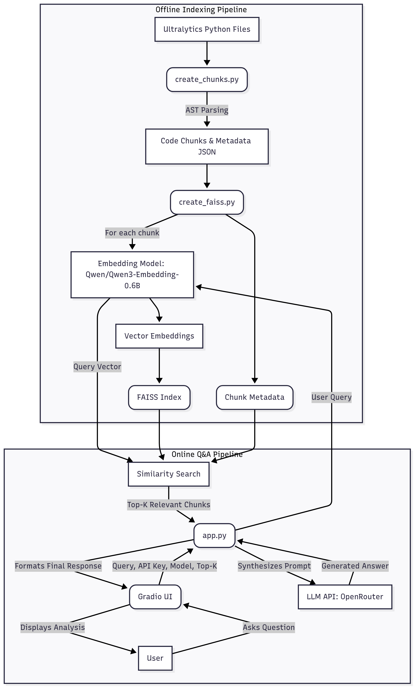
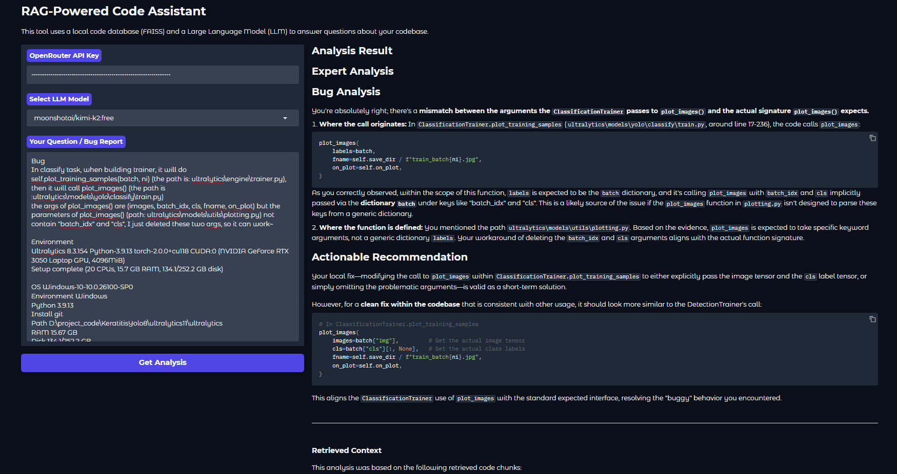
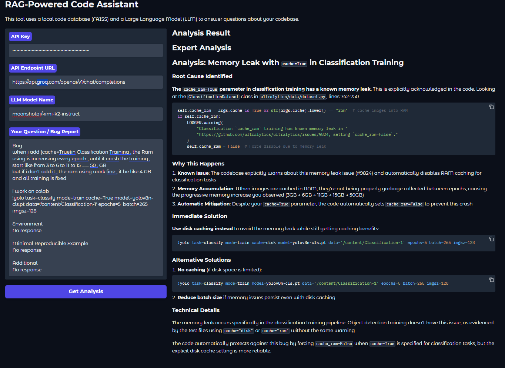
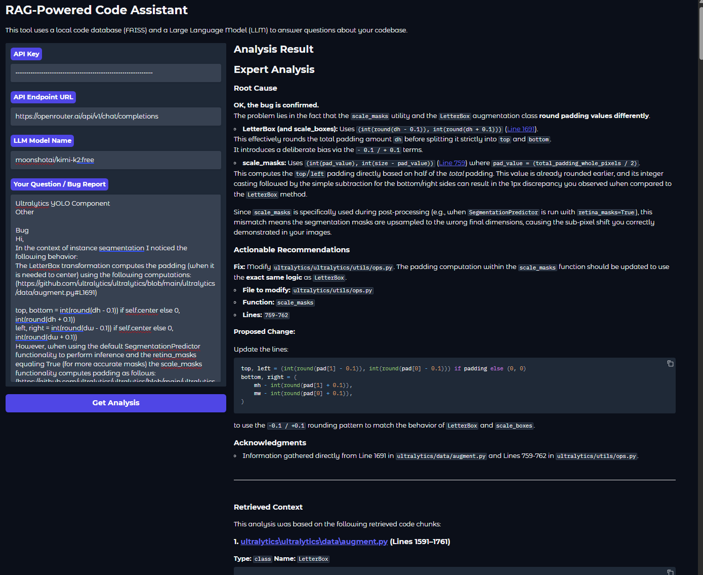
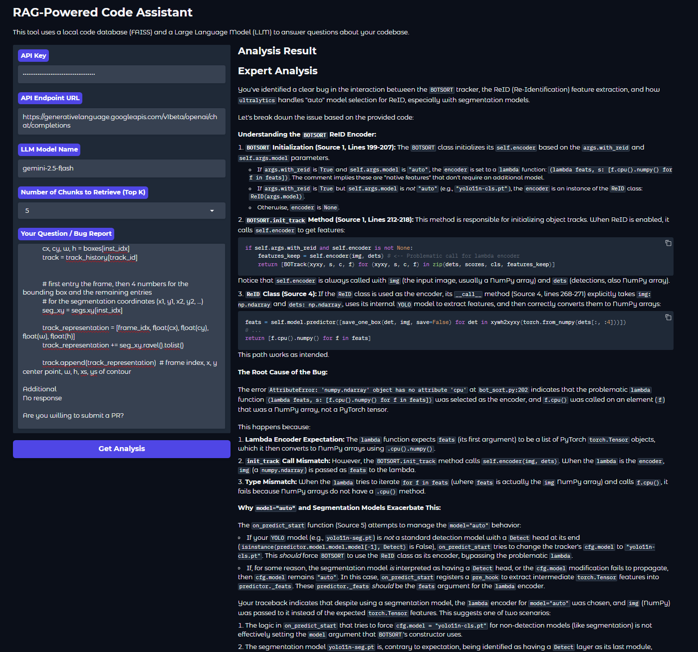
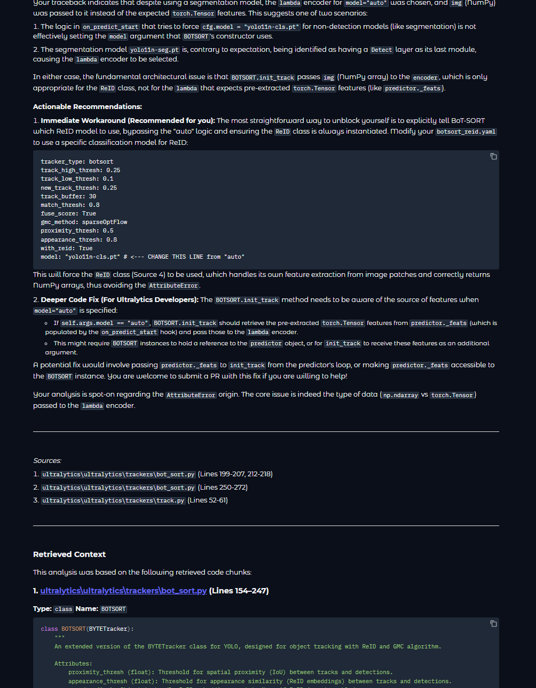
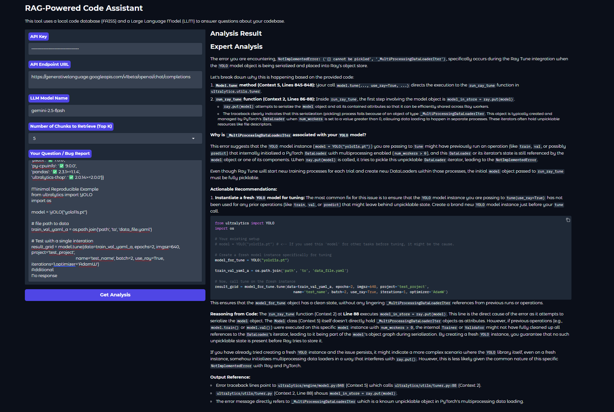

# codebase_RAG

# LLM-Powered Ultralytics Code Assistant

This project is a RAG (Retrieval-Augmented Generation) based code assistant designed to answer questions about the [Ultralytics YOLO](https://github.com/ultralytics/ultralytics) codebase. It uses a vector database to find relevant source code snippets and a Large Language Model (LLM) to generate helpful, context-aware answers.


## Core Features

- **Gradio Web UI**: An intuitive chat interface for asking questions.
- **AST-Based Code Indexing**: Intelligently chunks Python code from the YOLO repository.
- **Local Vector Search**: Uses FAISS for fast, local similarity search to retrieve relevant code.
- **LLM-Powered Generation**: Leverages powerful open-source models via OpenRouter to generate answers.

## Setup and Installation

This project uses `uv` for fast and efficient package management.

1.  **Clone the repository:**
    ```bash
    git clone https://github.com/sayedmohamedscu/codebase_RAG
    cd codebase_RAG
    ```

2.  **Create and activate a virtual environment:**
    ```bash
    # Install uv if you haven't already
    pip install uv

    # Create a virtual environment
    uv venv
    source .venv/bin/activate # On Windows, use `.venv\Scripts\activate`
    ```

3.  **Install dependencies:**
    ```bash
    uv pip install -r pyproject.toml
    ```

4.  **Prepare the Code Data:**
    * First, you need to create a `code_chunks.json` file from the Ultralytics repository.
    ```bash
    create_chunks.py "please edit the directory based on your requirments"
    ```
    * Then, create the vector index:
    ```bash
    python create_faiss.py
    ```
    This will generate `code_faiss.index` and `code_metadata.json`.

5.  **Run the application:**
    ```bash
    python app.py
    ```
    Open the local URL provided by Gradio in your browser.

---

## Design Notes

This section details the key design decisions and trade-offs made during development.

### 1. Code Chunking Strategy

**Method:** Code is chunked based on its Abstract Syntax Tree (AST). The parsing script iterates through the AST of each Python file and extracts logical blocks like classes, functions, and methods as individual chunks.

**Rationale:**
- **Contextual Integrity**: Unlike naive fixed-size or recursive character splitting, AST-based chunking ensures that complete, logical units of code are kept together. This provides the embedding model with the full context of a function or class, leading to more meaningful vector representations.
- **Metadata Richness**: This method allows for the extraction of precise metadata for each chunk, including its name ,type (`function`, `class`), and exact line numbers. This metadata is crucial for the LLM to understand the code's structure and for providing accurate source references in its answers.

### 2. Model Choices

#### Embedding Model: `Qwen/Qwen3-Embedding-0.6B`

**Rationale:** The choice of embedding model is a critical trade-off between retrieval quality, speed, and resource cost.
- **Performance**: As shown on the MTEB leaderboard, `Qwen-Embedding-0.6B` is a top-performing open-source model, competing with much larger models.
- **Efficiency**: With 595M parameters and a relatively small memory footprint, it provides an excellent balance. It's powerful enough for high-quality retrieval without requiring enterprise-grade hardware, making it perfect for local development and demonstration.
- **Code Specialization**: While not exclusively a "code" model, its strong performance on diverse text tasks translates well to understanding the semantic meaning within code and docstrings (thinking abouth ).

#### Generative LLM: OpenRouter Free Models

**Rationale:** The `app.py` interface allows the user to select from several powerful LLMs available on OpenRouter's free tier (e.g., `mistralai/devstral-small`, `kimi-k2`) or other providers (local too ).
- **Flexibility & Cost-Effectiveness**: This approach empowers users to balance performance with budget. One can select a fast, inexpensive model for simple queries or a state-of-the-art model for complex bug analysis, giving direct control over cost.
- **Proven Efficiency**: The system's strength is demonstrated by its excellent performance even with smaller, highly efficient models like mistralai/devstral-small. This proves that the high-quality retrieved context makes the system effective without needing to rely on the largest, most expensive LLMs.

### 3. Vector Database: FAISS

**Rationale:** The project requirement was to use MongoDB Atlas. However, for this proof-of-concept, I chose **FAISS (Facebook AI Similarity Search)**.

**Trade-offs:**
- **Pros (FAISS)**:
    - **Speed & Simplicity**: FAISS is an incredibly fast, in-memory library. It requires no network overhead, no external services, and is simple to integrate into a Python script, which accelerated the development of the core RAG logic.
    - **Portability**: The entire application, including the vector index, can be run locally from a single folder without any cloud dependencies.
- **Cons (vs. MongoDB Atlas)**:
    - **Scalability**: FAISS runs in-memory, which limits the index size to the available RAM. MongoDB Atlas is a managed service that can scale to billions of vectors.
    - **Persistence & Management**: The FAISS index is a static file. It must be manually rebuilt to update the data. MongoDB Atlas provides a managed, persistent database with a rich API for real-time data updates, metadata filtering, and robust production features.

This was a strategic trade-off to prioritize development speed and focus on the RAG pipeline's quality over production infrastructure for this specific assignment.

---

## Future Work & Scalability

Here is a roadmap for improving the assistant and preparing it for a production environment.

### 1. Potential Improvements

- **Learn From User Feedback & previous solved bugs** : Use the previous solved bugs with a RAG to match if this a relevent and solved before or could benfites from wht we already have
- **Finetune the embedding model**: Finetune the embedding model based on our case for better retrival on the sel;ected codebase.
-  **Hybrid Search**: Implement a hybrid search mechanism that combines dense vector search (for semantic meaning) with sparse keyword search (e.g., BM25). This would improve retrieval for queries containing specific, literal terms like function names (`autobatch`) or error messages that vector search might miss https://www.anthropic.com/news/contextual-retrieval.
- **Graph-based RAG**: Model the codebase as a graph where nodes are code chunks (functions, classes) and edges represent relationships (e.g., function calls, class inheritance). When a node is retrieved, the RAG system could also fetch connected nodes, providing the LLM with a much richer context of how different parts of the code interact https://github.com/vitali87/code-graph-rag.
- **Query Transformation & Self-Correction**: Add a preliminary LLM call to refine the user's query into a more optimal search query. For example, "my ram is blowing up" could be transformed into "memory leak OR high RAM usage in data loading OR caching mechanism". The system could also evaluate the relevance of retrieved chunks and automatically re-query if the initial results are poor.
- **Chat History & Follow-ups**: Make the application stateful by incorporating chat history. This would allow the LLM to understand follow-up questions and provide more coherent, conversational answers.

### 2. Scaling to Production

- **Managed Vector Database**: The first step would be to migrate from the local FAISS index to a scalable, managed solution . This would provide the persistence, scalability, and real-time indexing capabilities needed for a production system.
- **CI/CD for Indexing**: Set up a CI/CD pipeline (e.g., using GitHub Actions) that automatically triggers the re-indexing process whenever the main branch of the Ultralytics repository is updated. This ensures the assistant's knowledge is always current.
- **Containerization & Deployment**: Dockerize the application (Gradio UI, retrieval logic, API endpoints) and deploy it on a scalable cloud platform like **Google** or **AWS**. This would provide auto-scaling, reliability, and easy management.
- **Monitoring**: Integrate logging and monitoring tools (e.g., Prometheus, Grafana) to track performance, query latency, and answer quality.


## **Diagram** 
   

## Showcases

Here are some real-world examples of how this RAG system has been used to help solve issues in the Ultralytics repository:

### Issue Resolution Examples

1. **Memory Management Issue** - [GitHub Issue #21062](https://github.com/ultralytics/ultralytics/issues/21062)
   

2. **Configuration Problem** - [GitHub Issue #9824](https://github.com/ultralytics/ultralytics/issues/9824)
   

3. **Training Issue** - [GitHub Issue #20953](https://github.com/ultralytics/ultralytics/issues/20953)
   

4. **Multi-part Solution** - [GitHub Issue #21175](https://github.com/ultralytics/ultralytics/issues/21175)
   
   

5. **Performance Optimization** - [GitHub Issue #21427](https://github.com/ultralytics/ultralytics/issues/21427)
   